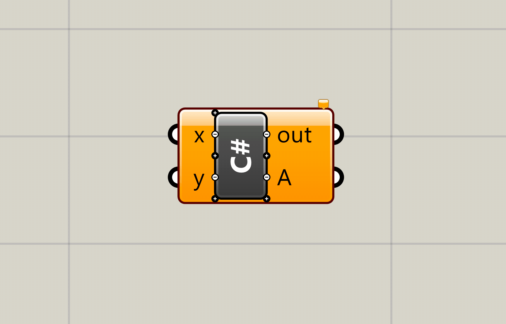

# Grasshopper C# scripting in VSCode

This folder contains everything that is necessary to create grasshopper scripts using the popular editor [Visual Studio Code](https://code.visualstudio.com), also known as **VSCode**.

**VSCode** is a powerfull text editor capable of interpreting multiple languages.

## Software requirements

For this to run properlly, you will need to have downloaded and installed in your computer the following programs:

- [VSCode](https://code.visualstudio.com)
- [Rhino 6](https://rhino3d.com)
- [.NetFramework 4.5.2 Developer pack](<[https://link](https://dotnet.microsoft.com/download/dotnet-framework/net452)>)
  

### Grasshopper plug-ins

You will also need to install the grasshopper plugin **Script Parasite**, an open source project that allows comunication between the native C# scripting component that comes from grasshopper and a specific file saved in our computer.

You can find and download the latest version from it's [Food4Rhino page](https://www.food4rhino.com/app/scriptparasite-grasshopper).

Once installed, you will see a new component appear under the **Math** tab inside _Grasshopper_.

## Setting up VSCode

### Quick setup

### Manual setup

## Setting up our Grasshopper file

### Scripting Parasite behaviour

Scripting Parasite (from now on, SP) will name your C# files using a specific convention. All files created by the _SP_ will be This is to prevent multiple _SP_ components to read and write from the same file at the same time.

The naming convention is the following: The **_nickname_** of the C# scripting component will be processed, all special characters will be converted to underscores `_`, all whitespace characters will be converted to dashes `-` and finally, it will append to the resulting string the unique identifier of that specific C# component.

> For example, the default name of the C# script component in _Grasshopper_ is `C#`, so the resulting `.cs` file that _SP_ will create will have a name like `c_-e3ec9.cs`.
> If we had changed the name of the _Grasshopper_ component to `Pyramid Generator`, the resulting file would have been named `Pyramid-Generator-e3ec9.cs` instead.

### Creating a C# component

#### Name your component

Naming is essential to keep track of our different scritps, as the default name will always be something like `c-5b253.cs`, wich will definitelly get confusing over time. It is way better to have a script named `pyramid-generator-5b253.cs`.

> Remember to ALWAYS NAME YOUR COMPONENTS APPROPRIATELY!

#### Deciding inputs and outputs

Just as important as _naming_, it is good practice to decide what would the **main** inputs and outpus are going to be, and what are they going to be called. This can always be changed later, but it can cause some headaches.

> ##### Things to consider
>
> - What is the minimum information needed in your script?
>   - For each of the inputs, consider the access protocol
>     1. Item -> Is it just a single entity? i.e.: The create point component will work by providing just one number on each of its inputs (X,Y,Z).
>     2. List -> Is it a list of entities? i.e.: The polyline component will only work if the input is a list of points, but never with just a single one.
>     3. Tree -> Is it a more complex structure of data?
> - What is the desired output format (numbers, strings, points, meshes...) and how many different outputs do you need?
>   - i.e.: The deconstruct mesh component has only one input, but 4 outputs.
>   - i.e.: The custom preview component has two inputs, but 0 outputs.

To help in this task, it is usually helpful to try and formulate the script that you want to do in the form of a very concrete sentence. Consider the following:

- A script that creates **a** point (Pt) given it's cartesian coordinates **(X,Y,Z)**
  - Input: 3 numbers called X,Y,Z using item access.
  - Output: A single point called Pt.
- A script that takes **a** mesh (M) and returns it's faces (F), vertices (V), colors (C), and normals (N).
  - Input: A single mesh called M using item access.
  - Output: 4 different outputs (V,F,C,N) each of them returning a list of entities.
- A script that bakes any structure with geometry to the Rhino model on the press of a button.
  - Input: A boolean input (Trigger) to simulate a button with item acces and a generic geometry input (G) with tree access, since it has to accomodate any kind of input in any data structure form.

Obviously, if the goal you are trying to achieve is very complex, this phrases can also become quite complex. Although, this is usually a sign that you are trying to do more than you should in a single component, and maybe you should consider breaking the functionality down into smaller parts.

#### Connecting _PS_ to the scripting component

This part should be fairly easy. If you are reading this file from GitHub, go ahead and download the repository files somewhere in your computer.

The _PS_ component has only two inputs. The first one is the _Enable_ toggle, to prevent it from updating the code inside the C# component. The second one is the path of the folder where you want _PS_ to look for your scripts. Create a panel in grasshopper and put the path to the folder you just downloaded. Note that, if you input any other folder path, *PS* will automatically create the project files for you (only valid for Windows).

> You will only need to specify this folder the first time _PS_ runs, as it will remember the last valid location that was introduced.

